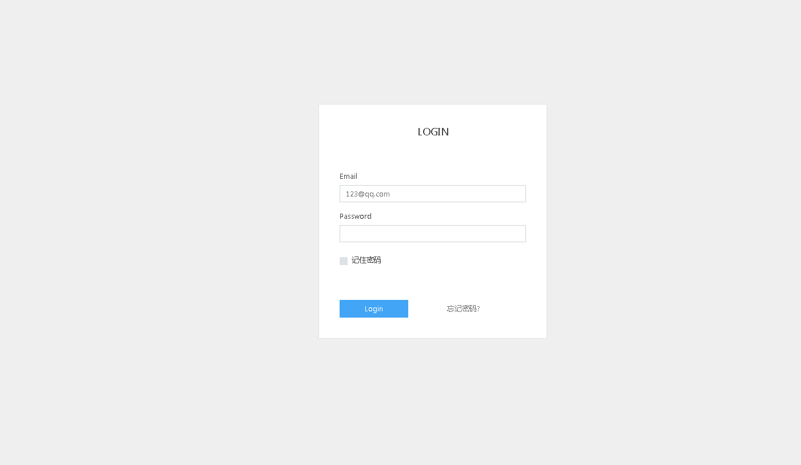
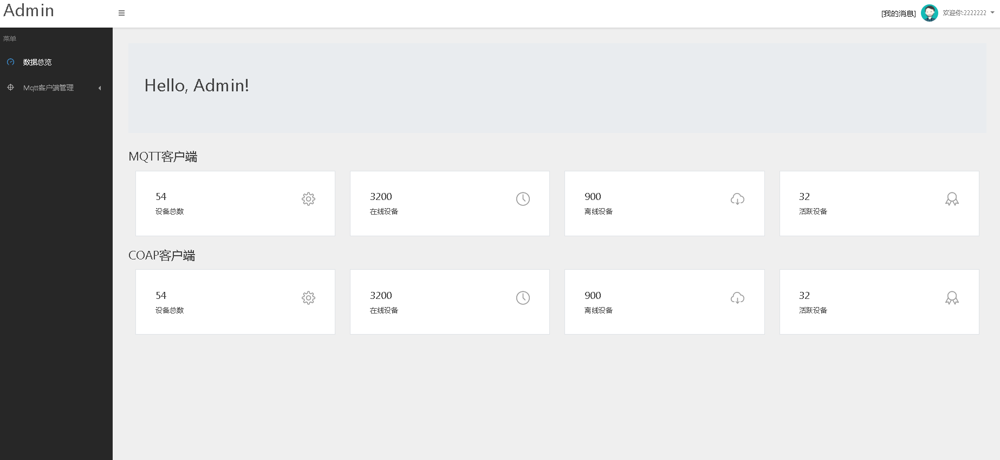
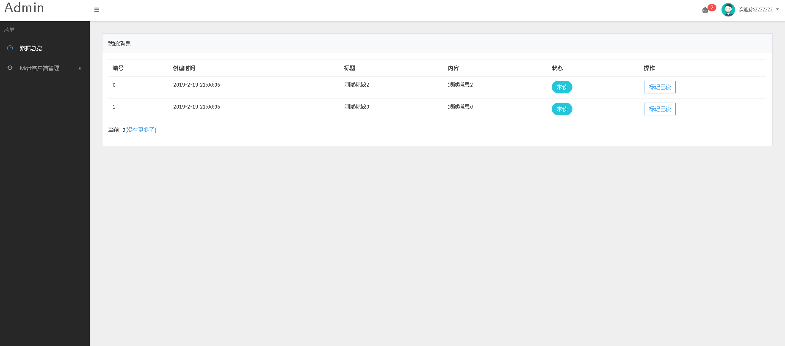
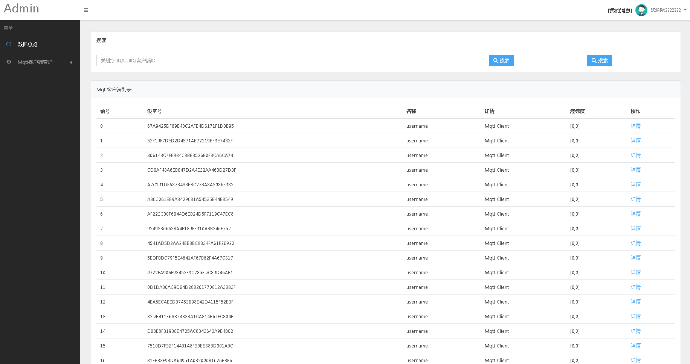
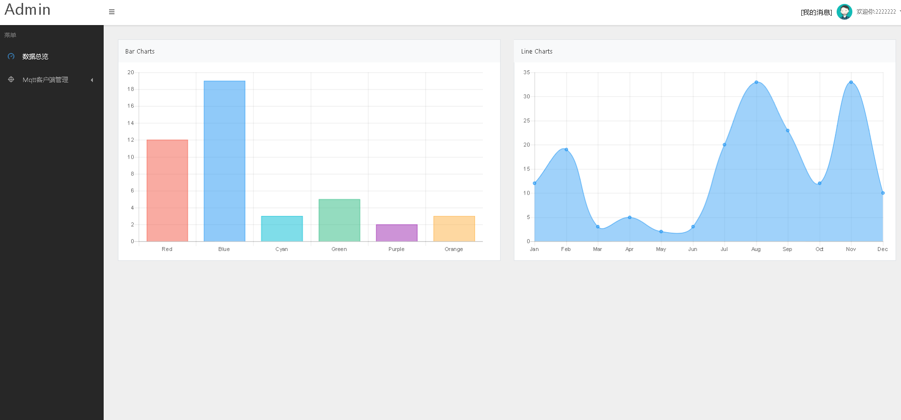

# EasyLinkerV3 物联网课程配套项目
# 1.简介
```
群里有不少朋友，经常问我能不能出一些开发一个物联网平台的教程，因为本人工作平时很忙，几乎没空处理这些问题，看到不少朋友
还是很希望有一套教程入门，于是今年准备做一套视频+一个简单的平台，以便大家学习入门同时视频会传到B站，希望大家关注一下.
```
# 2.主要技术

1. Java:主要的后端语言
2. Html,Js,Css;前端样式表
3. Mysql:数据持久化

# 3.课程目录
## 第一阶段:基础平台搭建和学习
1. 课程简介
2. 开发环境搭建
3. 开发知识准备
4. 用户管理功能实战
5. 设备(客户端)管理实战
6. 数据展示功能实战
7. 进阶:Linux服务器环境搭建和项目部署
8. 小项目实战:实现温湿度上传模拟

## 第二阶段:开始玩开发板


1. ESP8266开发板介绍
2. ArduinoIDE介绍
3. 第一个应用:LED闪烁
4. 从引脚读取数据:DHT11模块的应用
5. ESP8266网络基础
6. 进阶:远程控制LED开关
7. 项目实战:温湿度监控平台

# 前期DEMO预览
## 登录

## 控制台

## 系统消息

## 设备列表

## 数据展示

